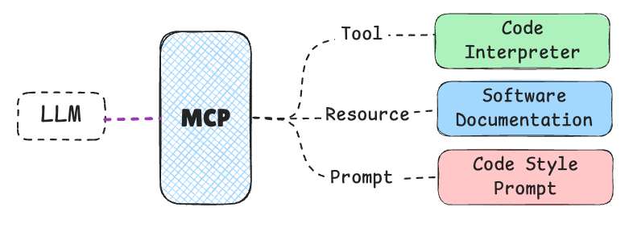

# HF MCP Course
[hf-mcp-course](https://huggingface.co/learn/mcp-course/unit0/introduction)

## Part1.  Introduction to Model Context Protocol (MCP)
 
### what Model Context Protocol is and why it’s important MCP概念

人工智能生态系统正在快速演进，大型语言模型（LLM）及其他 AI 系统的能力日益增强。然而，这些模型往往受限于训练数据，无法获取实时信息或调用专业工具，导致在许多场景下难以为用户提供真正相关、准确且有用的回答。

Model Context Protocol（MCP）应运而生。它使 AI 模型能够连接外部数据源、工具与环境，实现 AI 系统与更广阔数字世界之间的信息及能力无缝流转。这种互操作性对于培育并推广真正实用的 AI 应用至关重要。

### The integration challenges that MCP solves

集成难题:是在没有统一标准的情况下，将 M 种不同的 AI 应用逐一接入 N 种外部工具或数据源所面临的挑战.

### The key concepts and terminology associated with MCP MCP的核心概念和组件

核心概念 : MCP 与 HTTP 或 USB-C 一样，是一套标准协议，用于将 AI 应用连接到外部工具与数据源。因此，使用统一的术语对于 MCP 的高效运作至关重要。

组件 :

    主机（Host）：
        最终用户直接交互的 AI 应用。例如 Anthropic 的 Claude Desktop、AI 增强型 IDE（如 Cursor）、推理库（如 Hugging Face Python SDK），或基于 LangChain、smolagents 等框架构建的自定义应用。主机负责发起与 MCP 服务器的连接，并在用户请求、大模型处理与外部工具之间协调整体流程。

    客户端（Client）：
        位于主机应用内部的一个组件，用于与某个特定的 MCP 服务器通信。每个客户端与单个服务器保持 1:1 连接，负责处理 MCP 协议层面的通信细节，充当主机逻辑与外部服务器之间的中介。

    服务器（Server）：
        通过 MCP 协议暴露能力（工具、资源、提示词）的外部程序或服务。
    
很多资料把“客户端”和“主机”混为一谈。严格来说，主机是面向用户的应用，而客户端是主机内部专门负责与某个 MCP 服务器通信的组件。

|Capability | 说明                                                                  | 示例                                  |
| -------------- | ------------------------------------------------------------------- | ----------------------------------- |
| Tools（工具）      | 可由 AI 模型主动调用的可执行函数，用于执行特定动作或获取计算后的数据，通常与具体业务场景紧密相关。                 | 天气应用提供的“根据城市名返回实时天气”函数。             |
| Resources（资源）  | 只读数据源，为对话或任务提供背景信息，无需复杂计算。                                          | 科研助手暴露的“最新 arXiv 论文列表”只读接口。         |
| Prompts（提示模板）  | 预定义的交互模板或工作流，用于引导用户、AI 模型与可用能力之间的协作。                                | “把下面这段文字压缩成 100 字以内”的总结提示。          |
| Sampling（采样）   | 由服务器发起、让客户端/主机再次调用 LLM 的机制，实现递归式 AI 协作：LLM 先生成内容，再自我审视并决定是否需要进一步迭代。 | 写作应用在生成文章后，自行决定“再润色一次”并调用 LLM 继续优化。 |

### A simple example of MCP integration in action

上图展示了 Tools、Resources、Prompts、Sampling 这四种实体/能力(Entity)是如何被组合起来，共同支撑一个『代码智能体（code agent）』这一具体场景的.

| 实体/能力 类型                 | 名称                      | 说明                                          |
| -------------------- | ----------------------- | ------------------------------------------- |
| Tool（工具）         | Code Interpreter（代码解释器） | 可以执行 LLM 所编写代码的工具。                          |
| Resource（资源）     | Documentation（文档）       | 包含该应用自身文档的只读数据源，供 LLM 查阅。                   |
| Prompt     | Code Style（代码风格）        | 一段预置提示，引导 LLM 按既定规范生成代码。                    |
| Sampling（采样/再调用） | Code Review（代码审查）       | 允许服务器触发主机再次调用 LLM，让模型自己审阅已生成代码并决定是否需要进一步修改。 |

**在 MCP 的语境里，entities 并不是指“实体”这种抽象概念，而是 “暴露给 AI 的四类具体能力条目” 的统称。**

### MCP 的架构组成