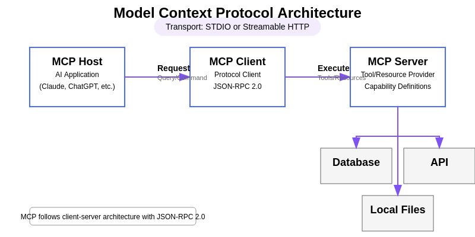

# HF MCP Course

[hf-mcp-course](https://huggingface.co/learn/mcp-course/unit0/introduction)

## Part1.  Introduction to Model Context Protocol (MCP)

### what Model Context Protocol is and why it’s important MCP概念

模型往往受限于训练数据，无法获取实时信息或调用专业工具，导致在许多场景下难以为用户提供真正相关、准确且有用的回答。

Model Context Protocol（MCP）使 AI 模型能够连接外部数据源、工具与环境，实现 AI 系统与更广阔数字世界之间的信息及能力无缝流转。这种互操作性对于培育并推广真正实用的 AI 应用至关重要。

### The integration challenges that MCP solves

集成难题:是在没有统一标准的情况下，将 M 种不同的 AI 应用逐一接入 N 种外部工具或数据源所面临的挑战.

没有MCP时：

    每个AI应用都要单独对接每个工具，就像每个手机都要配专属的充电器。
    如果有10个AI应用和10个工具，就需要做10×10=100种不同的对接方式，非常麻烦。

有了MCP后：

    所有AI应用统一用同一种"插头"（MCP协议）去连接工具。
    现在只需要：10个AI应用各实现一次MCP客户端 + 10个工具各实现一次MCP服务端 = 总共20次实现。

### The key concepts and terminology associated with MCP MCP的核心概念和组件

核心概念 : MCP 与 HTTP 或 USB-C 一样，是一套标准协议，用于将 AI 应用连接到外部工具与数据源。因此，使用统一的术语对于 MCP 的高效运作至关重要。

    标准化接口：解决重复对接问题
    明确分工：Host-Client-Server三层结构
    四大能力：Tools/Resources/Prompts/Sampling覆盖AI应用常见需求

|Capability | 说明                                                                  | 示例                                  |
| -------------- | ------------------------------------------------------------------- | ----------------------------------- |
| Tools（工具）      | 可由 AI 模型主动调用的可执行函数，用于执行特定动作或获取计算后的数据，通常与具体业务场景紧密相关。                 | 天气应用提供的“根据城市名返回实时天气”函数。             |
| Resources（资源）  | 只读数据源，为对话或任务提供背景信息，无需复杂计算。                                          | 科研助手暴露的“最新 arXiv 论文列表”只读接口。         |
| Prompts（提示模板）  | 预定义的交互模板或工作流，用于引导用户、AI 模型与可用能力之间的协作。                                | “把下面这段文字压缩成 100 字以内”的总结提示。          |
| Sampling（采样）   | 由服务器发起、让客户端/主机再次调用 LLM 的机制，实现递归式 AI 协作：LLM 先生成内容，再自我审视并决定是否需要进一步迭代。 | 写作应用在生成文章后，自行决定“再润色一次”并调用 LLM 继续优化。 |

### A simple example of MCP integration in action


上图展示了 Tools、Resources、Prompts、Sampling 这四种实体/能力(Entity)是如何被组合起来，共同支撑一个『代码智能体（code agent）』这一具体场景的.

| 实体/能力 类型                 | 名称                      | 说明                                          |
| -------------------- | ----------------------- | ------------------------------------------- |
| Tool（工具）         | Code Interpreter（代码解释器） | 可以执行 LLM 所编写代码的工具。                          |
| Resource（资源）     | Documentation（文档）       | 包含该应用自身文档的只读数据源，供 LLM 查阅。                   |
| Prompt     | Code Style（代码风格）        | 一段预置提示，引导 LLM 按既定规范生成代码。                    |
| Sampling（采样/再调用） | Code Review（代码审查）       | 允许服务器触发主机再次调用 LLM，让模型自己审阅已生成代码并决定是否需要进一步修改。 |

**在 MCP 的语境里，entities 并不是指“实体”这种抽象概念，而是 “暴露给 AI 的四类具体能力条目” 的统称。**

### MCP 的架构组成



架构 :

| MCP术语      | 描述       | 作用                       |
| ---------- | -------- | ------------------------ |
| Host   | 用户直接使用的AI应用（比如Claude桌面版）      | 主机负责管理用户交互与权限,通过 MCP 客户端发起与 MCP 服务器的连接,协调用户请求、大模型处理与外部工具之间的整体流程,以一致、连贯的格式向用户呈现结果。 |
| Client | Host内部负责和某个具体工具对接的小模块 | 个客户端与单个服务器保持 1:1 连接，负责处理 MCP 协议层面的通信细节，充当主机逻辑与外部服务器之间的中介。    |
| Server | 通过 MCP 协议暴露能力（工具、资源、提示词）的外部程序或服务.    |     提供对特定外部工具、数据源或服务的访问,作为现有功能的轻量级封装,可在本地（与主机同一台机器）或远程（通过网络）运行,以标准化格式暴露自身能力，供客户端发现与使用      |

注意：很多人把Host和Client混为一谈，但严格来说：

    Host是完整的AI应用（比如整个Claude软件）
    Client只是Host内部的一个小模块，专门负责对接某个工具

### MCP 组件交互

1. 用户交互:用户与主机（Host）应用交互，表达自己的意图或提出查询。
2. 主机处理:主机解析用户输入，可能调用大语言模型（LLM）来理解请求，并判断是否需要外部能力。
3. 客户端连接:主机指示其客户端（Client）组件连接到合适的服务器（Server）。
4. 能力发现:客户端向服务器查询，了解其提供了哪些能力（工具、资源、提示词）。
5. 能力调用:根据用户需求或 LLM 的判断，主机让客户端调用服务器上的特定能力。
6. 服务器执行:服务器执行所请求的功能，并将结果返回给客户端。
7. 结果整合:客户端将结果回传给主机，主机将结果纳入 LLM 的上下文或直接呈现给用户。

这些交互模式背后遵循着若干关键原则，持续塑造并推动 MCP 的设计与演进：

    标准化：为 AI 连接提供通用协议
    简洁性：核心协议保持简单，同时支持高级特性
    安全性：敏感操作须经用户明确授权
    可发现性：能力可被动态发现
    可扩展性：通过版本控制与能力协商支持协议演进
    互操作性：确保不同实现、不同环境之间均可协同工作

### MCP 的通信协议

MCP 的核心采用 JSON-RPC 2.0 作为客户端与服务器之间所有通信的消息格式。JSON-RPC 是一种轻量级、以 JSON 编码的远程过程调用协议，具备以下优势：

    人类可读，调试方便
    语言无关，可在任何编程环境中实现
    规范成熟，文档清晰，已被广泛采纳

MCP的通信协议定义了三种消息类型:请求（Requests）, 响应（Responses）和 通知（Notifications）.

#### 请求

 一般由客户端发往服务器，用于启动一次操作。一条请求消息包含：

    唯一的标识符（id）
    要调用的方法名（例如 tools/call）
    该方法的参数（如有）

示例:

```json
{
  "jsonrpc": "2.0",
  "id": 1,
  "method": "tools/call",
  "params": {
    "name": "weather",
    "arguments": {
      "location": "San Francisco"
    }
  }
}
```

#### 响应（Responses）

由服务器发往客户端，作为对请求的答复。一条响应消息包含：

    • 与对应请求相同的 id
    • 成功时返回结果（result），失败时返回错误（error）

成功响应示例：

```JSON
{
  "jsonrpc": "2.0",
  "id": 1,
  "result": {
    "temperature": 62,
    "conditions": "Partly cloudy"
  }
}
```

错误响应示例：

```json
{
  "jsonrpc": "2.0",
  "id": 1,
  "error": {
    "code": -32602,
    "message": "Invalid location parameter"
  }
}
```

#### 消息

单向消息，无需回复。通常由服务器发往客户端，用于提供更新或事件通知。
通知示例：

```json
{
  "jsonrpc": "2.0",
  "method": "progress",
  "params": {
    "message": "Processing data...",
    "percent": 50
  }
}
```

### MCP 的传输机制

JSON-RPC 只定义了消息格式，MCP 进一步规定了这些消息在客户端与服务器之间如何传输。目前支持两种主要传输方式：

stdio（标准输入/输出）

    适用于本地通信场景，即客户端与服务器运行在同一台机器上：
    • 主机（Host）应用将服务器作为子进程启动，通过向该进程的标准输入（stdin）写入数据、并从其标准输出（stdout）读取数据来进行通信。
    • 典型用例：访问本地文件系统、运行本地脚本等工具。
    • 主要优点：实现简单、无需网络配置、由操作系统天然提供安全沙箱隔离。
    
HTTP + SSE（Server-Sent Events）/ 可流式 HTTP

    适用于远程通信场景，即客户端与服务器可能位于不同机器：
    • 通信基于 HTTP，服务器利用 Server-Sent Events（SSE）在一条持久连接上向客户端推送更新。
    • 典型用例：连接远程 API、云服务平台或共享资源。
    • 主要优点：跨网络工作、易于与现有 Web 服务集成、兼容无服务器（serverless）环境。
    MCP 标准的最新更新还引入了“可流式 HTTP”（Streamable HTTP）：服务器可在需要时动态升级为 SSE 流式传输，同时保持对无服务器环境的兼容性，从而获得更高的灵活性。

### MCP 交互生命周期

#### 初始化

客户端连接到服务器，双方交换协议版本与能力信息；服务器回应其支持的协议版本与能力。客户端通过一条通知消息确认初始化完成。

    💻 → initialize 🌐
    💻 ← response 🌐
    💻 → initialized 🌐


#### 发现

客户端请求可用的能力信息，服务器返回可用工具的列表。

    💻 → tools/list 🌐
    💻 ← response 🌐

#### 执行

客户端根据主机需求调用能力。

    💻 → tools/call 🌐
    💻 ← notification（可选进度） 🌐
    💻 ← response 🌐

#### 终止

当不再需要连接时，连接被优雅关闭，服务器确认关闭请求。

    💻 → shutdown 🌐
    💻 ← response 🌐
    💻 → exit 🌐